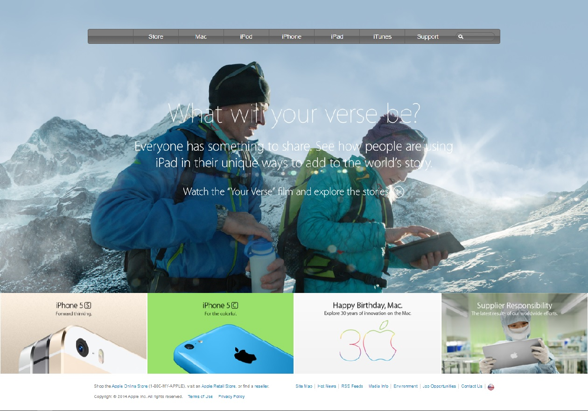

<!-- PROJECT LOGO -->
<br />
<p align="center">
   <h3 align="center">Old Apple Webpage Clone</h3>

  <p align="center">
    A replica of the old apple website with HTML and CSS!
    <br />
  </p>
</p>


<!-- ABOUT THE PROJECT -->
## About The Project

<br/>
<p align="center">
  <a href="https://github.com/othneildrew/Best-README-Template">
    
  </a>
</p>

The purpose of making this clone is to practice the use of linear gradients and embedding images from CSS. 

### Built With
This section was built with:
* [HTML5](https://developer.mozilla.org/es/docs/Glossary/HTML5)
* [CSS](https://developer.mozilla.org/es/docs/Web/CSS)


<!-- GETTING STARTED -->
## Getting Started

### Prerequisites

* npm
```sh
npm install npm@latest -g
```

### Installation

1. Clone the repo
```sh
git clone https://github.com/ClintonEnyinna/old-apple-page-clone.git
```
2. Go to the app directory
```sh
cd old-apple-page-clone
```
3. Open with visual studio code
```sh
code . 
```

<!-- CONTRIBUTING -->
## Contributing

Any contributions you make are **greatly appreciated**.

1. Fork the Project
2. Create your Feature Branch (`git checkout -b feature/AmazingFeature`)
3. Commit your Changes (`git commit -m 'Add some AmazingFeature'`)
4. Push to the Branch (`git push origin feature/AmazingFeature`)
5. Open a Pull Request


<!-- LICENSE -->
## License

Distributed under the MIT License. See `LICENSE` for more information.


<!-- CONTACT -->
## Contact

Clinton Enyinna - [@github](https://github.com/ClintonEnyinna)

Project Link: [https://github.com/ClintonEnyinna/old-apple-page-clone](https://github.com/ClintonEnyinna/old-apple-page-clone)
